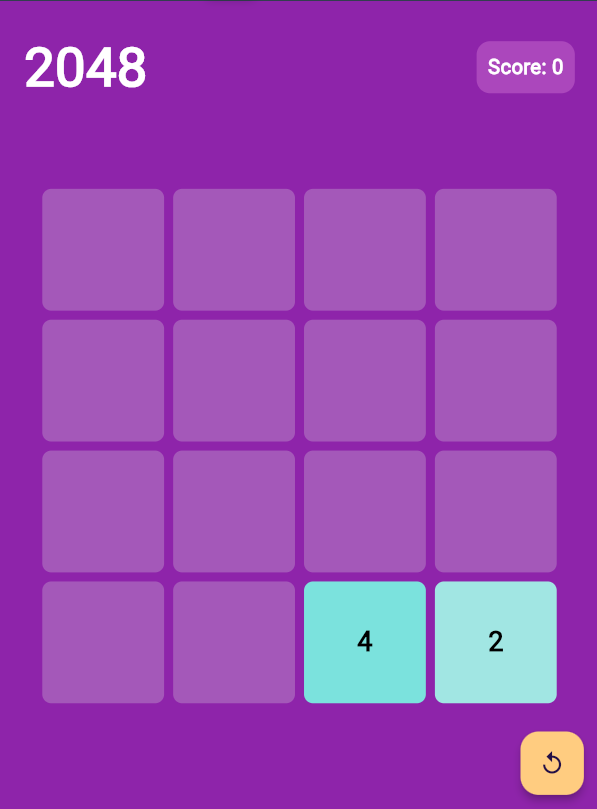

# 2048 Flutter Game

Un jeu **2048** réalisé en Flutter. Le but du jeu est de glisser des tuiles numérotées pour les fusionner et atteindre la tuile **2048**.

## Fonctionnalités

- Grille de jeu 4x4 qui réagit aux gestes de glissement (swipe).
- Fusion des tuiles de même valeur (puissances de 2).
- Score mis à jour en fonction des fusions.
- Réinitialisation du jeu avec un bouton "Reset".
- Message **Game Over** affiché lorsque le joueur ne peut plus faire de mouvements.
  
## Captures d'écran



## Installation

1. Clone ce dépôt sur ton environnement local :

   ```bash
   git clone https://github.com/Grand0x/2048-flutter.git
   ```

2. Accédez au dossier du projet :

   ```bash
   cd 2048-flutter
   ```

3. Installe les dépendances Flutter :

   ```bash
   flutter pub get
   ```

4. Lance l'application sur un simulateur ou un appareil physique :

   ```bash
   flutter run
   ```

## Règles du jeu

- Le jeu se déroule sur une grille de **4x4**.
- À chaque déplacement, une nouvelle tuile de valeur **2** ou **4** apparaît dans une case vide.
- Les tuiles de même valeur se fusionnent lorsqu'elles se rencontrent, formant une tuile avec la somme de leurs valeurs (par exemple, deux tuiles **2** deviennent une tuile **4**).
- Le but est de créer une tuile avec la valeur **2048**.
- Le jeu se termine lorsque plus aucun mouvement n'est possible (aucune case vide et aucune fusion possible).

## Structure du projet

- `main.dart` : Point d'entrée de l'application, contenant la structure principale de l'interface (grille, score, bouton de réinitialisation).
- `grid.dart` : Contient la logique du jeu, y compris la gestion de la grille, des mouvements et du score.
- `gameboard.dart` : Widget `GameBoard` qui affiche la grille et les tuiles. Capture les mouvements de swipe pour déplacer les tuiles.
- `tile.dart` : Widget qui représente une tuile individuelle dans la grille.
- `scoreboard.dart` : Widget qui affiche le score.

## Comment jouer

- Glisse les tuiles dans l'une des directions : **gauche**, **droite**, **haut**, **bas**.
- Lorsque deux tuiles de même valeur se rencontrent, elles se fusionnent.
- Continue de glisser les tuiles pour atteindre la tuile **2048**.
- Appuie sur le bouton "Reset" pour recommencer une nouvelle partie.

## Dépendances

- [Flutter SDK](https://flutter.dev) : Framework utilisé pour développer l'application mobile.
- Aucune autre dépendance externe n'est requise pour ce projet.

## Contribution

Les contributions sont les bienvenues ! Si vous souhaitez améliorer le projet, n'hésitez pas à soumettre une pull request ou à ouvrir une issue.

1. Fork le projet
2. Crée une branche de fonctionnalité (`git checkout -b feature/nom-fonctionnalite`)
3. Committez vos changements (`git commit -m 'Ajout de la fonctionnalité X'`)
4. Poussez votre branche (`git push origin feature/nom-fonctionnalite`)
5. Ouvrez une Pull Request

## License

Ce projet est sous licence MIT.

## Remerciements

- Inspiré par le jeu original **[2048](https://play2048.co)**.

### Explication des sections :

1. **Fonctionnalités** : Liste les principales fonctionnalités du jeu, comme les mouvements, le score et le message "Game Over".
2. **Installation** : Guide étape par étape pour cloner le projet, installer les dépendances et lancer l'application.
3. **Règles du jeu** : Explication des règles de base du jeu 2048.
4. **Structure du projet** : Présentation des fichiers principaux du projet et leur rôle.
5. **Comment jouer** : Instructions pour interagir avec le jeu.
6. **Contribution** : Instructions pour les contributeurs potentiels.
7. **License** : Informations sur la licence du projet.
